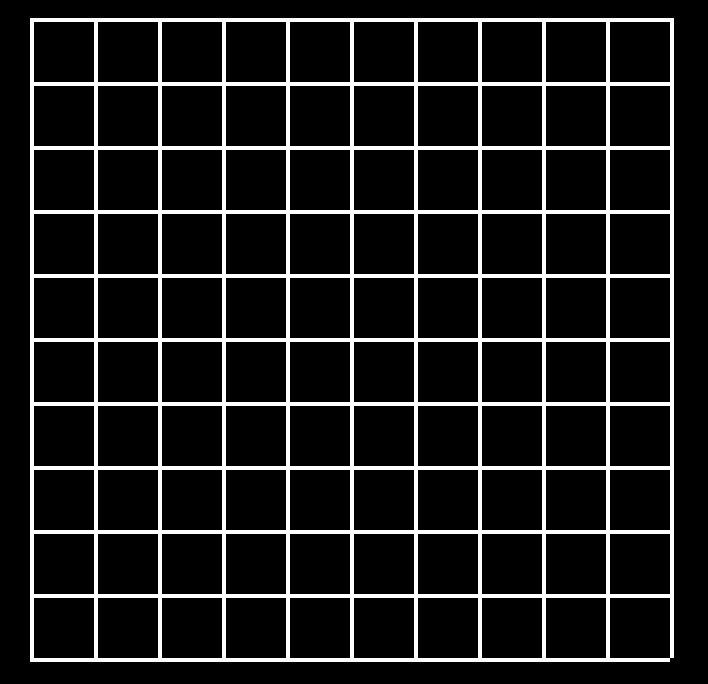

<h1>Map Editor</h1>

A side project to help with making and rendering maps into my C++ game, DDC.

<h2> 21st August </h2>

Snap Grid:

The next step is to get the tile to automatically, align to the cell no matter where the mouse position is within that cell. Basically the math works like this:

`mousePositionAxisX/pixelsPerCell = converted to an integer, mousePositionAxisY/pixelsPerCell = converted to an integer`

In converting to an integer everything after the decimal point disappears, its not rounding up or down, just dropping that data. So it will revert to 0,0 or 1,0 and we can then use that to place the tile to the corner filling the whole cell by

`multiplying by pixelsPerCell`

```cpp

  int x = mousePosition.x / 32;
  int xx = x * 32;

  int y = mousePosition.y / 32;
  int yy = y * 32;

  sf::Vector2i position(xx, yy);

  tile.setPosition(static_cast<sf::Vector2f>(position));

```

<h2> 20th August </h2>

The tutorial(#23), is taking a lot of time refactoring the code. I understand that this is helpful and as I get better at coding, rewatching this will be helpful but right now, I am eager to continue with my game. So I am happy to hard code my variables but know that if I make something in the future, I can come back and re-use this code.

<h2> 19th August </h2>

Set up my repo and main.cpp.

Main should include

- Initialise
- Load
- Update
- Draw

Initialise, we create the window and set a framerate limit.

Load, while window is open (game loop) we load any functions, variables and clasess.

Update, we update our event polling loop

Draw, draw clear and display.

To run application, we must create a `Makefile`, I just copied and pasted this, changing the app name and class to be loaded.

Step 1: Create a grid class.

The math is that we use a for loop for each axis to render out lines, but include a `+ 1` to close it off.



To fill in that missing pixel in the corner, the thickness of the line (in this case 2) is added to the horizontal length using `+2`
